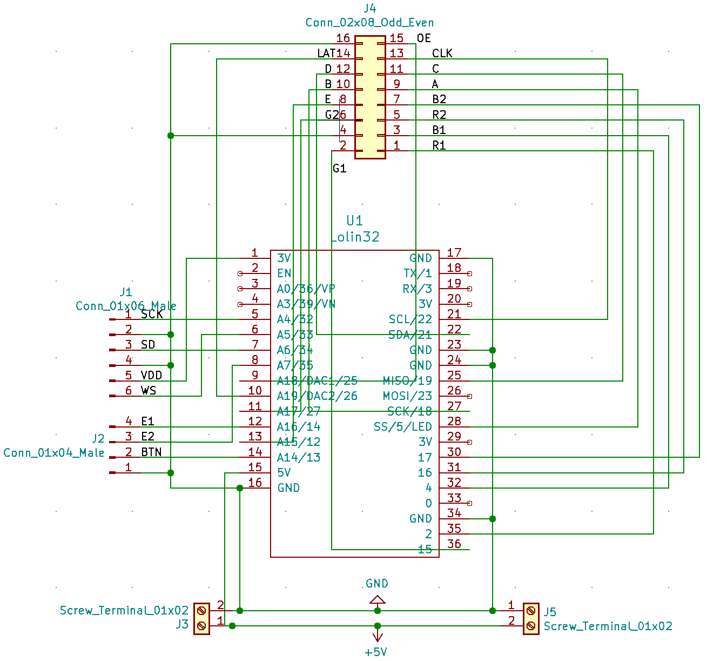
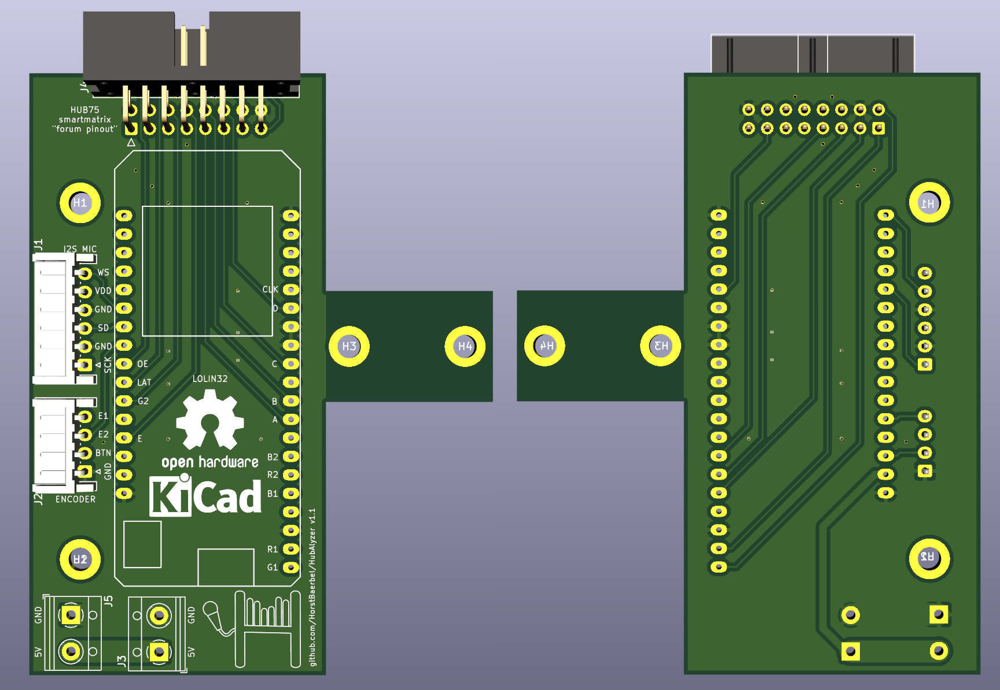

# HubAlyzer

    

An ESP32 spectrum analyzer display for HUB75 RGB LED panels and I2S microphones (INMP441). Uses the [ESP32 Arduino core](https://github.com/espressif/arduino-esp32), the [Smartmatrix v4](https://github.com/pixelmatix/SmartMatrix) RGB LED panel library, [Ivan Kostoski I2S microphone library](https://github.com/ikostoski/esp32-i2s-slm) and the development version of the [ArduinoFFT](https://github.com/kosme/arduinoFFT/tree/develop) library.

    
        
        
    

## Schematics

The circuit is using the SmartMatrix ["forum pinout"](https://github.com/pixelmatix/SmartMatrix/blob/fdb60faf8b140326c75761ac29970e48ac9cc6db/src/MatrixHardware_ESP32_V0.h#L208) without any level shifters for the LED matrix. This working fine for me for two 32x16 matrices chained together. It includes the "E" pin for driving 64x64 matrices.

    
        
    

## Making the PCB

See the [KiCad](KiCad) directory for the PCB files. You can upload the PCB file straight to e.g. [Aisler.net](Aisler.net) and get some pretty PCBs made.

    
        
    

## Updating your network configuration

Edit [HubAlyzer/network_config.h](HubAlyzer/network_config.h) and put your WiFi network and password there. Make sure NOT to commit the file and upload to GitHub when forking the repo!
